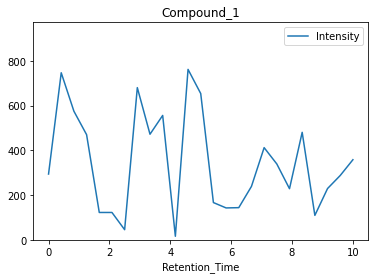

# Spectral Analysis
## Introduction

The HPLC-data set is a collection of intensities, probably emitted wave lenghts, recorded at different points in time from a starting point. These intensities with their respective times are assigned to a sample. This data set is aimed at analysis via machine learning methods.

## Objective

By employing machine learning methods - e.g. analysis via Convolutional Neural Networks (CNN) or Leave One Out Cross Validation (LOCV) - ideal timings or similarites could be derived from the data set. Time series analysis on individual compounds would be possible also.

## Features

**Compound**: named tested sample
**Retention_Time**: time interval from starting point of experiment
**Intensity**: measured wave length

## Sample Data

| Compound | Retention_Time | Intensity |
| :--: | :-------------: | :--: |
| Compound_1 |	0.000000	| 294.3890 |
| Compound_1	| 0.416667	| 747.2610 |
| Compound_1 |	0.833333 |	575.3470 |
| Compound_1	| 1.250000	| 470.5460 |
| Compound_1	| 1.666670	| 122.6310 |

## Visualization

| Compound_1 | Retention_Time |	Intensity |
| :--: | :-------------: | :--: |
| count |	25.000000 |	25.000000 |
| mean	| 5.000000	| 346.467804 |
| std	| 3.066584	| 224.181274 |
| min	| 0.000000	| 16.179400 |
| 25%	| 2.500000	| 144.156000 |
| 50%	| 5.000000	| 294.389000 |
| 75%	| 7.500000	| 480.916000 |
| max	| 10.000000	| 762.349000 |

## Methodology

Outline the methodology used in the project. This may include:
- Data preprocessing steps
- Feature engineering
- Model selection and training
- Hyperparameter tuning
- Evaluation metrics

## Results
Present the results of the study. Include:
- Performance metrics
- Visualizations (e.g., graphs, charts) to illustrate the results
- Discussion of the results and their implications

## Conclusion
Summarize the findings of the project. Discuss the significance of the results and any potential limitations of the study.

## Future Work
Using Convolutional Neural Network for environmental pollution predictions.

## Contributors
roadrunner_gs（slommage@hu-berlin.de）

## License
-

## References
Include any references or citations used in the project.

## Acknowledgements
-
