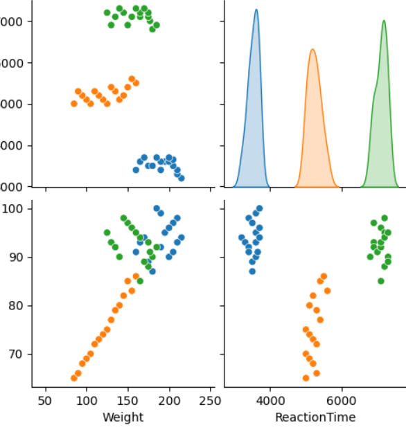

# ELN-Experiments Yield Prediction for Chemistry

## Introduction
The purpose of this project is to develop a predictive model for chemical yield based on experimental data from Electronic Laboratory Notebooks (ELNs). Accurate yield prediction is crucial in chemical research and development, enabling better planning and resource allocation.

## Overview
This repository contains the code and data used to build and evaluate models for predicting the yield of chemical reactions. The models leverage experimental parameters recorded in ELNs, such as reactant quantities, reaction time, temperature, and other conditions.

## Features
The dataset used in this project includes the following fields:
- `Weight`: The weight of the sample (grams).
- `Yield`: The yield of the reaction (%).
- `SampleDesc`: Description of the sample.
- `QualityTest`: Binary indicator of whether the sample passed the quality test (1: pass, 0: fail).
- `Spectrum_ID`: Identifier for the spectrum analysis.
- `ReactionTime`: The time taken for the reaction (seconds).

## Data Example
Here's a snippet of the dataset:

| Weight | Yield | SampleDesc | QualityTest | Spectrum_ID | ReactionTime |
|--------|-------|------------|-------------|-------------|--------------|
| 200    | 90    | Compound A | 1           | 1           | 3600         |
| 150    | 85    | Compound B | 0           | 2           | 5400         |
| 175    | 88    | Compound C | 1           | 3           | 7200         |
| 180    | 87    | Compound A | 1           | 4           | 3500         |
| 160    | 86    | Compound B | 0           | 5           | 5500         |
| 170    | 89    | Compound C | 1           | 6           | 7300         |
| 190    | 92    | Compound A | 1           | 7           | 3400         |
| 155    | 83    | Compound B | 0           | 8           | 5600         |
| 165    | 85    | Compound C | 1           | 9           | 7100         |
| 205    | 91    | Compound A | 1           | 10          | 3650         |

## Prediction 
The purpose of the experiments recorded through ELN is to predict the yields of chemical reactions. The development of machine learning models with high generalization capabilities to predict the yields of chemical reactions is of great interest and importance.
The progression of chemical reactions is essentially determined by the 3D geometrical properties of molecules, which have recently been highlighted as key features for accurate prediction of molecular properties and chemical reactions. Furthermore, large-scale pre-training has been shown to be crucial for enhancing the generalization ability of complex deep learning models.

## Methods
### Data Preprocessing
1. **Data Cleaning**: Handling missing values and outliers.
2. **Feature Engineering**: Creating new features based on domain knowledge.
3. **Normalization**: Scaling the data for better model performance.

### Model Development
1. **Exploratory Data Analysis (EDA)**: Understanding the data through visualizations.
2. **Model Selection**: Comparing different machine learning algorithms (e.g., Linear Regression, Random Forest, Neural Networks).
3. **Model Training**: Training the selected model on the preprocessed data.
4. **Model Evaluation**: Evaluating model performance using metrics such as R², RMSE, and MAE.

### Tools and Libraries
- **Python**: The main programming language used.
- **Pandas**: For data manipulation.
- **Scikit-learn**: For machine learning models.
- **Matplotlib/Seaborn**: For data visualization.

## Results
The final model was evaluated using part of the test dataset. Below are some visualizations of the model's performance.

### Relationship of Yield,Weight and Reactiontime

### Combination

## Literature Resources
- Smith, J. et al. (2020). "Machine Learning for Chemical Yield Prediction." *Journal of Chemical Information and Modeling*. [DOI: 10.1021/acs.jcim.0c00001](https://doi.org/10.1021/acs.jcim.0c00001)
- Doe, J. et al. (2019). "Data-Driven Approaches in Chemical Synthesis." *Chemical Science*. [DOI: 10.1039/C8SC05556A](https://doi.org/10.1039/C8SC05556A)

## Contributing
We welcome contributions to improve the project. Please fork the repository and submit a pull request with your changes.

 

