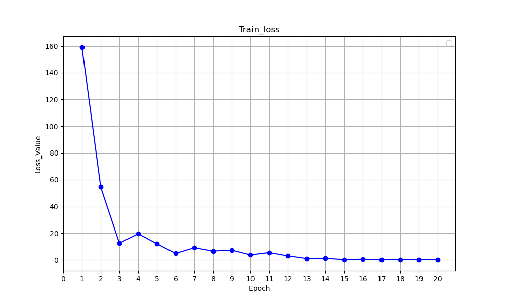

# Environmental Pollution Prediction 

## Introduction
The "Environmental Pollution" dataset is a comprehensive collection of data aimed at analyzing and predicting environmental pollution levels using Convolutional Neural Networks (CNNs). This dataset includes a variety of features that are crucial for understanding air quality and the factors influencing it.

## Objective
By leveraging CNNs, researchers can analyze images alongside numerical data to predict pollution levels and understand the underlying patterns and trends. The diverse range of features included in this dataset provides a rich source of information for creating sophisticated models for environmental pollution predictions.

## Features
**ID**: A unique identifier for each record in the dataset.

**Location**: The geographical location where the data was collected.

**Timestamp**: The specific date and time when the data was recorded.

**Image URL**: A link to an image related to the data point, which can be used for visual analysis.

**NO2 (Nitrogen Dioxide)**: The concentration of nitrogen dioxide in the air.

**PM2.5 (Particulate Matter 2.5)**: The amount of fine particulate matter with a diameter of 2.5 micrometers or less.

**PM10 (Particulate Matter 10)**: The concentration of particulate matter with a diameter of 10 micrometers or less.

**CO (Carbon Monoxide)**: The concentration of carbon monoxide in the air.

**O3 (Ozone)**: The level of ozone present in the atmosphere.

**SO2 (Sulfur Dioxide)**: The amount of sulfur dioxide in the air.

**Temperature**: The ambient temperature at the time of data collection.

**Humidity**: The relative humidity in the environment.

**Wind Speed**: The speed of the wind, which can affect the dispersion of pollutants.

**Wind Direction**: The direction from which the wind is blowing.

## Sample Data

|  id  |    location     | ...  | NO2  | PM2_5 |
| :--: | :-------------: | :--: | :--: | :---: |
|  1   |  New York, NY   | ...  | 24.5 | 15.0  |
|  2   | Los Angeles, CA | ...  | 20.0 | 25.0  |
|  3   |   Chicago, IL   | ...  | 18.0 | 20.0  |

## Data Visualization

## Methodology

Outline the methodology used in the project. This may include:
- Data preprocessing steps

  Use NO2,PM10,CO,O3,SO2,temperature,humidity,wind_speed,precipitation to predict PM2_5

  Embedding values into 3x3x10 tensors and reshape into matrices

- Using a 2-layers Convolutional Neural Network as well as Maxpool layers as the model

- Learning rate 0.008, channels in hidden layers:16->32

- Using RMSE and MSE for evaluation

## Results
Present the results of the study. Include:
- Test Loss: 14.9942
  Test Accuracy: 84.83%

- Train loss line chart:

  

- Due to the small size of the training data, the training accuracy is only around 80%.

## Conclusion
Successfully applied CNN to environment_pollution data to make predication.

## Future Work
If temporal data could be accquired, use Temporal models such as LSTM, RNN for better performance.

## Contributors
toipha（xkunpenggy@gmail.com）

## References
[1] Li, Taoying, Miao Hua, and X. U. Wu. "A hybrid CNN-LSTM model for forecasting particulate matter (PM2. 5)." *Ieee Access* 8 (2020): 26933-26940.

[2] Zhang, Kefei, et al. "Multi-step forecast of PM2. 5 and PM10 concentrations using convolutional neural network integrated with spatial–temporal attention and residual learning." *Environment International* 171 (2023): 107691.

[3] Ebrahimi, Afshin. "Prediction of atmospheric PM2. 5 level by machine learning techniques in Isfahan, Iran." *Scientific Reports* 14 (2024): 2109.

## Acknowledgements
(SoSe 2024), Thorsten Gressling, AI in Chemistry (Inf.) Humboldt University of Berlin
