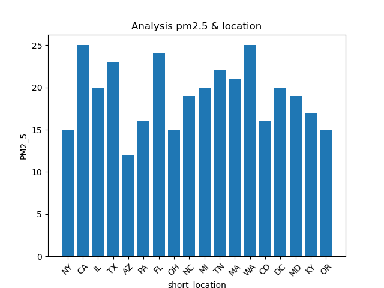
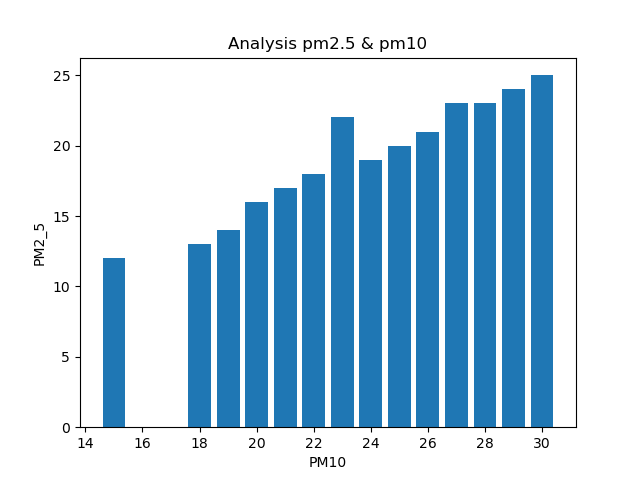
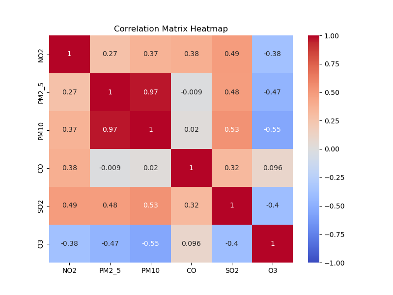
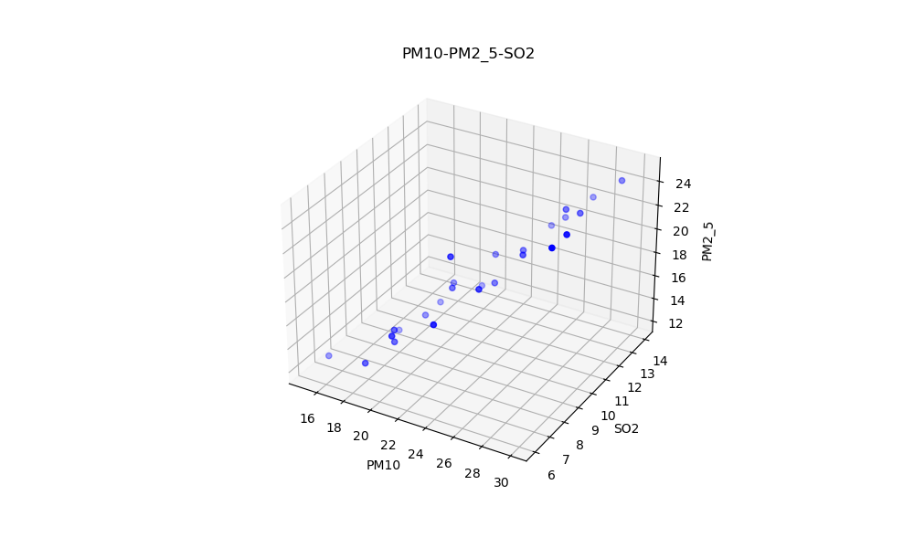

# Environmental Pollution Prediction 

## Introduction
The "Environmental Pollution" dataset is a comprehensive collection of data aimed at analyzing and predicting environmental pollution levels using Convolutional Neural Networks (CNNs). This dataset includes a variety of features that are crucial for understanding air quality and the factors influencing it.

## Objective
By leveraging CNNs, researchers can analyze images alongside numerical data to predict pollution levels and understand the underlying patterns and trends. The diverse range of features included in this dataset provides a rich source of information for creating sophisticated models for environmental pollution predictions.

## Features
**ID**: A unique identifier for each record in the dataset.

**Location**: The geographical location where the data was collected.

**Timestamp**: The specific date and time when the data was recorded.

**Image URL**: A link to an image related to the data point, which can be used for visual analysis.

**NO2 (Nitrogen Dioxide)**: The concentration of nitrogen dioxide in the air.

**PM2.5 (Particulate Matter 2.5)**: The amount of fine particulate matter with a diameter of 2.5 micrometers or less.

**PM10 (Particulate Matter 10)**: The concentration of particulate matter with a diameter of 10 micrometers or less.

**CO (Carbon Monoxide)**: The concentration of carbon monoxide in the air.

**O3 (Ozone)**: The level of ozone present in the atmosphere.

**SO2 (Sulfur Dioxide)**: The amount of sulfur dioxide in the air.

**Temperature**: The ambient temperature at the time of data collection.

**Humidity**: The relative humidity in the environment.

**Wind Speed**: The speed of the wind, which can affect the dispersion of pollutants.

**Wind Direction**: The direction from which the wind is blowing.

## Sample Data

|  id  |    location     | ...  | NO2  | PM2_5 |
| :--: | :-------------: | :--: | :--: | :---: |
|  1   |  New York, NY   | ...  | 24.5 | 15.0  |
|  2   | Los Angeles, CA | ...  | 20.0 | 25.0  |
|  3   |   Chicago, IL   | ...  | 18.0 | 20.0  |

## Data Visualization

## Methodology

Outline the methodology used in the project. This may include:
- Data preprocessing steps
- Feature engineering
- Model selection and training
- Hyperparameter tuning
- Evaluation metrics

## Results
Present the results of the study. Include:
- Performance metrics
- Visualizations (e.g., graphs, charts) to illustrate the results
- Discussion of the results and their implications

## Conclusion
Summarize the findings of the project. Discuss the significance of the results and any potential limitations of the study.

## Future Work
Using Convolutional Neural Network for environmental pollution predictions.

## Contributors
toipha（xkunpenggy@gmail.com）

## License
-

## References
Include any references or citations used in the project.

## Acknowledgements
-
