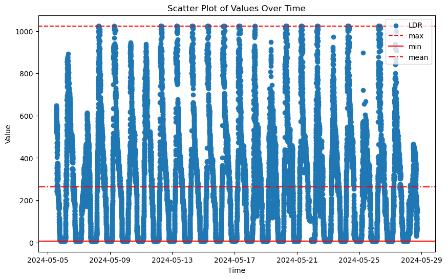

# LIMS-TimeSeries Google LLM

## Introduction

In recent years, the landscape of time-series forecasting 
(see this [Introduction into time-series forecasting](https://www.tableau.com/learn/articles/time-series-forecasting#:~:text=Time%20series%20forecasting%20occurs%20when,drive%20future%20strategic%20decision%2Dmaking)) has witnessed significant advancements, 
driven by the increasing availability of large-scale data and the development of sophisticated machine 
learning models. Google LLM ([Google TimesFM GitHub](https://github.com/google-research/timesfm)), with its powerful language modeling capabilities, presents a promising avenue 
for enhancing time-series forecasting accuracy and efficiency. This project, 
focuses on leveraging TimesFM, Google’s advanced foundation model, to improve forecasting performance in various
applications such as finance, weather prediction, and supply chain management. The motivation behind this study
stems from the need to address the limitations of traditional time-series models, which often struggle with
complex, non-linear patterns and require extensive domain-specific tuning. By harnessing the capabilities of
Google LLM through TimesFM, this project aims to explore new methodologies that offer more robust and 
generalizable forecasting solutions, ultimately contributing to better decision-making and planning across 
diverse sectors.

## Objective

The "LIMS_Timeseries_Google_LLM" project addresses the limitations of traditional time-series forecasting
models by leveraging Google's advanced language learning model (LLM) through TimesFM. The main problem is
improving the accuracy, robustness, and scalability of forecasts in various domains where traditional models
struggle with complex, non-linear patterns. Solving this problem could significantly enhance forecasting 
practices across industries, leading to more accurate predictions, better decision-making, and increased 
efficiency in financial planning, weather prediction, supply chain management, and resource allocation.

## Data

Following observations are made from the dataset:

* The data is consistently sampled at regular intervals.
* The LDR sensor readings (column _value) show a gradual decrease over time, indicating a potential change in light conditions.
* The measurement process and device remain consistent throughout the dataset.
* This dataset can be used to analyze the behavior of the LDR sensor over time, identifying trends or patterns in light intensity as recorded by the sensor.

### Columns:
* **_result**: Always empty.
* **table**: Identifies the table number.
* **_start**: The start time for the query range.
* **_stop**: The end time for the query range.
* **_time**: The timestamp for each measurement.
* **_value**: The LDR sensor value at the corresponding timestamp.
* **LDR**: The name of the sensor.
* **_field**: The field key, which is LDR.
* **_measurement**: The measurement name, which is LDR_status.
* **device**: The device name.

### Sample Data
| result | table | _start                         | _stop                          | _time                         | _value | LDR      | _field | _measurement | device  |
|--------|-------|--------------------------------|--------------------------------|-------------------------------|--------|----------|--------|--------------|---------|
|        | 0     | 2024-05-21T16:26:08.005460928Z | 2024-05-28T16:26:08.005460928Z | 2024-05-21T16:26:24.225905421Z | 259    | Sensor 1 | LDR    | LDR_status   | ESP8266 |
|        | 0     | 2024-05-21T16:26:08.005460928Z | 2024-05-28T16:26:08.005460928Z | 2024-05-21T16:27:26.508632008Z | 259    | Sensor 1 | LDR    | LDR_status   | ESP8266 |
|        | 0     | 2024-05-21T16:26:08.005460928Z | 2024-05-28T16:26:08.005460928Z | 2024-05-21T16:28:28.720152577Z | 256    | Sensor 1 | LDR    | LDR_status   | ESP8266 |
|        | 0     | 2024-05-21T16:26:08.005460928Z | 2024-05-28T16:26:08.005460928Z | 2024-05-21T16:29:30.888614698Z | 255    | Sensor 1 | LDR    | LDR_status   | ESP8266 |
|        | 0     | 2024-05-21T16:26:08.005460928Z | 2024-05-28T16:26:08.005460928Z | 2024-05-21T16:30:33.202673635Z | 261    | Sensor 1 | LDR    | LDR_status   | ESP8266 |
|        | 0     | 2024-05-21T16:26:08.005460928Z | 2024-05-28T16:26:08.005460928Z | 2024-05-21T16:31:35.411839943Z | 265    | Sensor 1 | LDR    | LDR_status   | ESP8266 |


### Source of the data:
This data is generated by a sensor network system, likely monitoring light levels (LDR) over time.
The device named "ESP8266" indicates it's collected from sensors connected through ESP8266 microcontrollers,
commonly used in IoT projects.

### Data collection methods:
The data is collected at regular intervals, and then transmitted to a central data storage system. 
Each data point is recorded approximately every minute.

### Data size and structure:
The dataset consists of multiple rows, each representing a data point collected at a specific time. 
Each row contains fields such as the timestamp of data collection, 
measured value (presumably light intensity), device identifier, and metadata like measurement 
type and device type. The data follows a tabular format with distinct columns for various attributes.

### Preprocessing steps applied to the data:
Preprocessing may include removing duplicate entries,
handling missing values, and converting timestamps into a more usable format. 
Additionally, normalization or scaling may be applied to ensure uniformity 
across different sensors or environments.

### Data Visualization:
Scatter Plot of Values Over Time:


## Features

In the dataset, several features stand out for machine learning modeling:

* **Timestamp (_time)**: This indicates when data points were recorded, crucial for time-series analysis. 
It helps capture temporal patterns, trends, and seasonality, aiding accurate predictions of light 
intensity changes over time.
Provides chronological order, enabling the model to understand temporal patterns and forecast future trends based on historical data.

* **Light intensity (_value)**: This feature represents measured light intensity, 
directly correlating with environmental conditions. Understanding its variations helps identify day-night 
cycles, weather changes, or indoor lighting shifts, crucial for applications like smart lighting control or 
security systems. Acts as the target variable, guiding the model to learn patterns in light intensity fluctuations over 
time, essential for accurate predictions.

* **Device identifier (device)**: Helps identify sensor-specific characteristics or anomalies. It's useful for tracking sensor performance,
detecting malfunctions, or understanding differences due to placement or calibration. Helps differentiate data 
from different sensors, allowing the model to learn sensor-specific behaviors and adjust forecasts accordingly.

* **Measurement type (_measurement)**: Specifies the type of recorded measurement, 
likely denoting status or readings from a Light Dependent Resistor (LDR) sensor. This ensures the 
model focuses on relevant data and avoids confusion with other measurement types. Specifies the type of data being 
recorded, ensuring the model focuses exclusively on light intensity measurements for forecasting tasks.

* **Other metadata features**: Features like "group" and "_field" offer contextual information but may not 
directly predict light intensity. They provide background data for understanding but aren't likely significant 
predictors in the model.

## Installation and Usage

### Prerequisites
Python installed on your system. Install the latest version of Python from the official website.
A InfluxDB database has to be running and accessible, with a bucket containing the required data. 
(Credentials such as org, bucket, url, and token are required to connect to the database.).
For more information on InfluxDB, visit the official
[InfluxDB documentation](https://docs.influxdata.com/influxdb/cloud/api-guide/client-libraries/python/).

### Installation Steps
Clone the repository to your local machine and navigate to the project directory using the following command,
to install the required packages (install using a virtual environment is recommended):

```bash
pip install -r requirements.txt
```
### Example Usage:

```python
# Import required libraries
import influxdb_client
import pandas as pd

# Set up connection parameters
org = "your_org"
bucket = "your_bucket"
url = "your_url"
token = "your_token"

# Create InfluxDB client instance
client = influxdb_client.InfluxDBClient(
    url=url,
    token=token,
    org=org
)

# Set up query API
query_api = client.query_api()

# Define query
query = f'from(bucket:"{bucket}")\
    |> range(start: 0, stop: now())\
    |> filter(fn: (r) => r._measurement == "LDR_status")\
    |> filter(fn: (r) => r._field == "LDR")\
    |> filter(fn: (r) => r.device == "ESP8266")\
    |> filter(fn: (r) => r.LDR == "Sensor 1")'

# Execute query
result = query_api.query(org=org, query=query)

# Convert result to Pandas DataFrame
results = []
for table in result:
  for record in table.records:
    results.append((record.get_field(), record.get_value(), record.get_time(), record.values.get("device")))

# Create DataFrame
df = pd.DataFrame(results, columns=['field', 'value', 'time', 'device'])
df.head(10)
```
# References
1. Google TimesFM GitHub: https://github.com/google-research/timesfm
2. Google TimesFM Article: https://towardsdatascience.com/timesfm-googles-foundation-model-for-time-series-forecasting-593a332dd08d
3. Time Series with Pandas: https://towardsdatascience.com/introducing-time-series-in-pandas-09c7cab569b4
4. Introduction into time-series forecasting:https://www.tableau.com/learn/articles/time-series-forecasting#:~:text=Time%20series%20forecasting%20occurs%20when,drive%20future%20strategic%20decision%2Dmaking