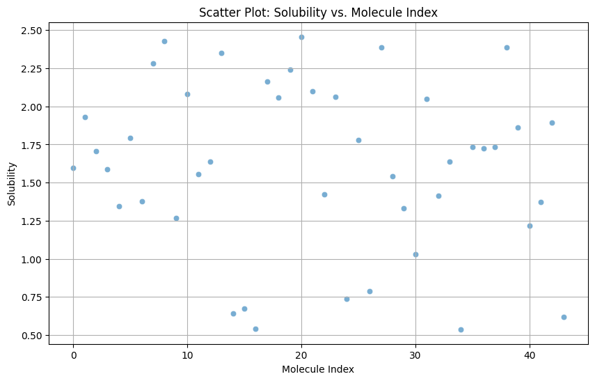
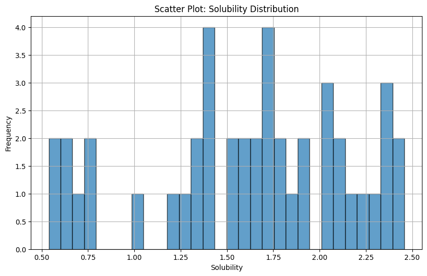

# B2-Solubility Prediction

## Introduction

This project involves constructing a Multilayer Perceptron (MLP) neural network with multiple dense layers. The MLP leverages features derived from the SMILES representation and solubility values of molecules. The primary goal is to predict the solubility of molecules using their SMILES representation as input.
 
## Objective

The objective of this project is to build a predictive model using an MLP neural network to estimate the solubility of molecules based on their SMILES representation. By doing so, we aim to gain insights into the relationship between molecular structure and solubility, which can be valuable in various chemical and pharmaceutical applications.

## Features

### Molecules Dataset
- **MoleculeID**: Unique identifier for the molecule.
- **FkeyUser**: Foreign key for user-related information.
- **MoleculeName**: Name of the molecule.
- **CanonialSmileFormat**: Canonical SMILES representation of the molecule.
- **CasId**: CAS registry number.
- **Fomular**: Molecular formula.
- **MOLFile**: Molecular file containing structural information.

### Molecule Solubility Dataset
- **id**: Unique identifier.
- **molecule_name**: Reference to the molecule ID.
- **smiles**: SMILES representation of the molecule.
- **solubility**: Solubility value of the molecule.

### Molecules Dataset
| MoleculeID | FkeyUser | MoleculeName     | CanonialSmileFormat        | CasId   | Fomular | MOLFile   |
|------------|----------|--------------|----------------------------|---------|---------|-----------|
| 1          | 1        | Acetaminophen    | CC(=O)NC1=CC=C(C=C1)O   | 103-90-2 | C8H9NO2  | 1983\n -OEChem-11082306173D\n\n 20 20 0 ... |
| 2          | 1        | Aspirin          | CC(=O)OC1=CC=CC=C1C(=O)O                   | 50-78-2| C9H8O4   | 2244\n -OEChem-11082306153D\n\n 21 21 0 ... |

### Molecule Solubility Dataset
| id | molecule_name | smiles                      | solubility |
|----|---------------|-----------------------------|------------|
| 1  | Molecule1             | C1=CC=CC=C1    | 1.59763       |
| 2  | Molecule2             | C2=CC=CC=C2    | 1.93038       |

## Statistical Overview

A brief statistical overview of the dataset includes the calculation of maxima, minima, and ranges for numerical features, as well as scatter plots to visualize relationships between features.

### Summary Statistics
| Statistic          | Solubility |
|--------------------|------------|
| Count              | 44         |
| Minimum            | 0.537580   |
| Maximum            | 2.457240   |
| Mean               | 1.615564   |
| Standard Deviation | 0.554093   |

### Scatter Plots
Scatter plots can be used to visualize the relationship between the solubility of molecules and their SMILES representation. For this project, we focus on creating meaningful visualizations that highlight trends and patterns in the data.

#### Scatter Plot: Solubility vs. Molecule Index

#### Scatter Plot: Solubility Distribution

## Methodology

### Data Preparation
1. **Data Merging**:
   - Merge the two datasets on the common molecule identifier to create a unified dataset that includes molecular information along with their solubility values.

### Feature Engineering
1. **SMILES Representation**:
   - Use the Canonical SMILES format from the `molecules` dataset as the primary feature for training the neural network.
   - Convert SMILES strings into numerical features using cheminformatics libraries like RDKit.

2. **Solubility Values**:
   - Use solubility values from `molecule_solubility` as the target variable for the predictive model.

### Model Building
1. **Multilayer Perceptron (MLP)**:
   - Construct an MLP neural network using a framework such as TensorFlow or PyTorch.
   - Design the network with multiple dense layers, specifying the number of neurons and activation functions for each layer.

2. **Training the Model**:
   - Split the dataset into training and validation sets.
   - Train the MLP model on the training set, using appropriate loss functions and optimization algorithms.
   - Validate the model on the validation set to tune hyperparameters and prevent overfitting.

### Model Evaluation
1. **Performance Metrics**:
   - Evaluate the model using metrics such as Mean Squared Error (MSE) or R-squared to measure the accuracy of solubility predictions.

## How to Present the Results

1. **Summary Statistics**:
   - Present the calculated summary statistics in a tabular format within the report or presentation slides.
   - Highlight key statistics such as mean, median, minimum, maximum, and standard deviation to provide an overview of the data distribution.

2. **Visualizations**:
   - Include scatter plots to show the relationship between molecular indices and solubility values.
   - Present histograms to illustrate the distribution of solubility values across the dataset.
   - Use a scatter plot to compare predicted solubility values against actual values, demonstrating the model's accuracy.

3. **Model Performance**:
   - Display model performance metrics (e.g., loss, mean absolute error) in tables or as bullet points.
   - Show visual aids like loss curves over training epochs to indicate the model's learning progress and potential overfitting or underfitting.

4. **Interpretation and Insights**:
   - Discuss the implications of the summary statistics and visualizations.
   - Explain the significance of the model's performance metrics and how they reflect the model's predictive power.
   - Provide insights derived from the analysis, such as any observable trends or patterns in the data.