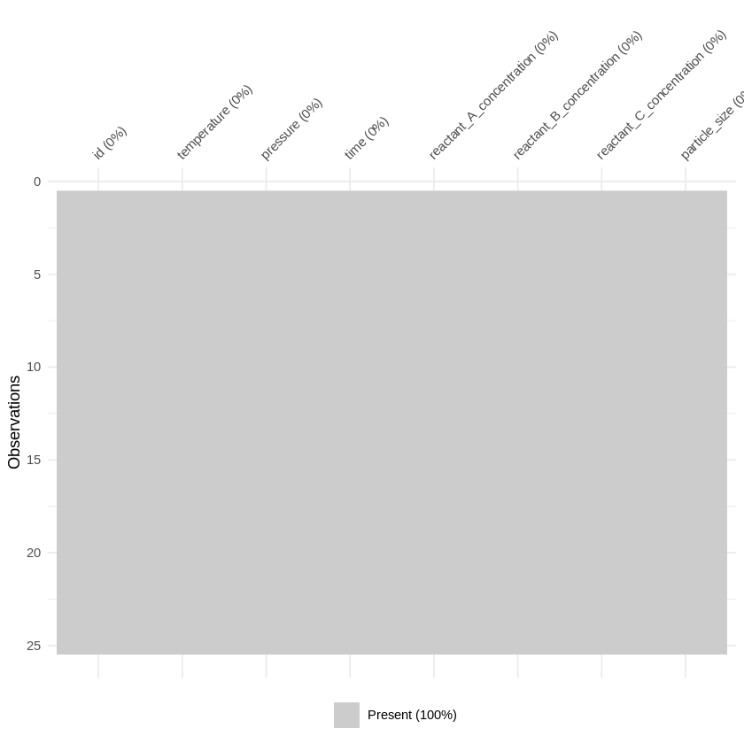
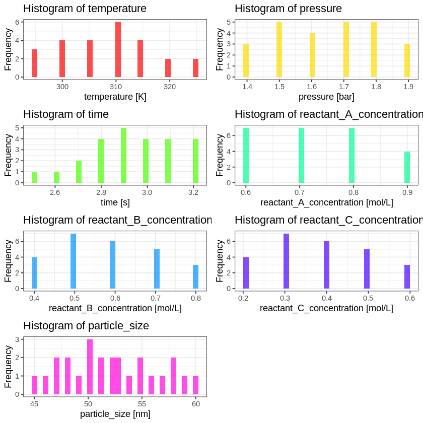
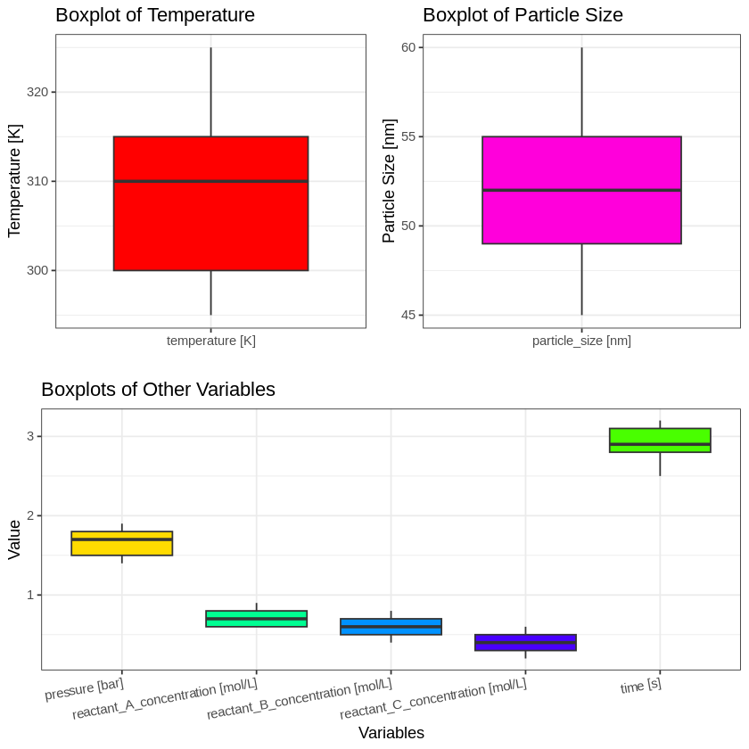
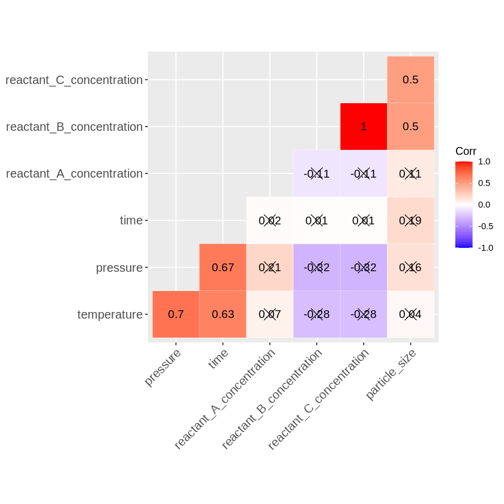
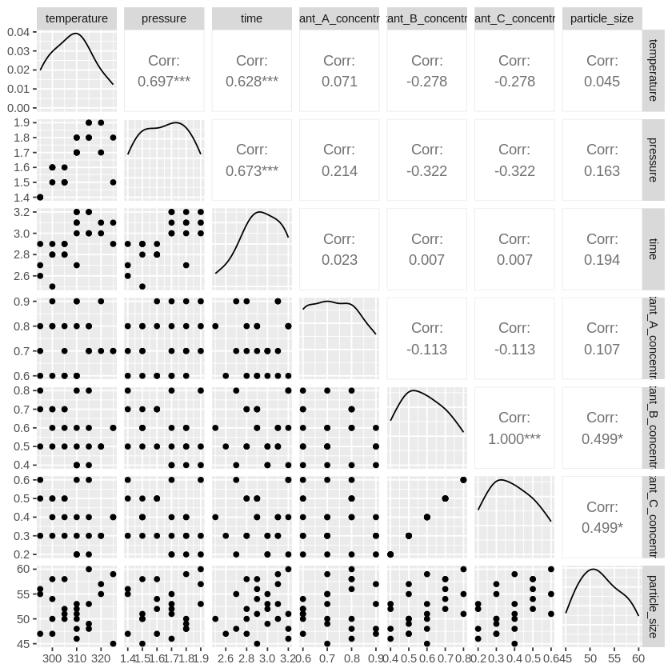

# Nanoparticle Synthesis Optimization

**Note**: This project consists of two Jupyter notebooks: `DA_nanoparticles.ipynb` and `nanoparticle_CNN_python.ipynb`. The first notebook deals with statistical analysis (consisting of descriptive and explorative analysis) and contains a first draft for a CNN in the programming language R. The second notebook takes up the CNN and realises it in Python. How these notebooks can be executed can be read under [Installation and Usage](#installation-and-usage).

## Introduction

Nanoparticles play a critical role in various industries, ranging from medicine to environmental science, due to their unique properties. The synthesis of nanoparticles is a complex process that can be optimized by understanding the relationships between different synthesis parameters and the resulting particle size. This project aims to explore and predict the particle size of nanoparticles based on various synthesis parameters. Understanding these relationships can lead to more efficient production methods, better quality control, and advancements in nanoparticle applications. The study leverages a combination of linear regression, generalized additive models, and convolutional neural networks to model these relationships. By accurately predicting particle size, manufacturers can ensure consistency and quality in nanoparticle production. This project also highlights the importance of statistical and machine learning methods in optimizing industrial processes. The findings of this study have the potential to improve the scalability and efficiency of nanoparticle synthesis, ultimately contributing to advancements in nanotechnology and its applications.

## Objective

The main objective of this project is to predict the particle size of nanoparticles based on various synthesis parameters such as temperature, pressure, time, and reactant concentrations. By identifying the key factors influencing particle size, the project aims to optimize the synthesis process. This optimization is crucial for improving the quality and consistency of nanoparticles, which have significant applications in fields like medicine, electronics, and environmental science. Understanding the underlying relationships between synthesis parameters and particle size can lead to more efficient production methods and better scalability.

## Data Used

### Source of the Data (Hypothetical)

The data used in this project is hypothetical and simulates a typical dataset that might be collected during nanoparticle synthesis experiments.

### Data Collection Methods

Data was collected through controlled laboratory experiments where various synthesis parameters were systematically varied, and the resulting particle sizes were measured. Each experiment records the temperature, pressure, synthesis time, and concentrations of three different reactants.

### Data Size and Structure

The dataset consists of 25 observations, with each observation representing a unique set of synthesis conditions and the resulting particle size. The structure of the dataset includes the following columns:
- `id`: Identifier for each experiment.
- `temperature`: Temperature during synthesis (in Kelvin).
- `pressure`: Pressure during synthesis (in bar).
- `time`: Time duration of the synthesis (in seconds).
- `reactant_A_concentration`: Concentration of reactant A (in mol/L).
- `reactant_B_concentration`: Concentration of reactant B (in mol/L).
- `reactant_C_concentration`: Concentration of reactant C (in mol/L).
- `particle_size`: Resulting particle size (in nanometres).

### Any Preprocessing Steps Applied to the Data
Note: everything is included in the notebook

1. **Checking for Missing Values**: Verified that there were no missing values in the dataset.

Preparation to build a CNN: 

2. **Normalization**: Standardized the predictor variables to ensure they are on a comparable scale. 
3. **Data Splitting**: Split the dataset into training and testing sets to evaluate model performance.

### Features

- **Temperature**: Impacts the reaction kinetics and the resulting particle size.
- **Pressure**: Influences the synthesis environment and the size of the particles formed.
- **Time**: Determines the duration over which the reactants interact.
- **Reactant A Concentration**: Amount of reactant A in the mixture.
- **Reactant B Concentration**: Amount of reactant B in the mixture, shows high correlation with particle size.
- **Reactant C Concentration**: Amount of reactant C in the mixture, shows high correlation with particle size.
- **Particle Size**: The dependent variable, representing the size of the nanoparticles synthesized.

### What will be predicted?

Information on setting up the model and selecting the endpoint can be found at [Model Selection and Training](#model-selection-and-training). In addition, a more detailed explanation can be found in the notebook `DA_nanoparticles.ipynb` under the section **Model Justification and Endpoint Selection**.

## Installation and Usage

### Prerequisites

To run the project in a Jupyter Notebook using Google Colab, follow these steps:

### Running in Google Colab

#### Running the R Version

1. **Open the Notebook in Colab**:
   - Upload the existing notebook (`DA_nanoparticles.ipynb`) to Google Drive.
   - Open the notebook in Google Colab.

2. **Change the Runtime Type**:
   - Go to the menu: `Runtime` > `Change runtime type`.
   - Select `R` from the `Runtime type` dropdown menu.
   - Click `Save`.

3. **Install Required Packages**:
   - At the top of this notebook is a cell in which all necessary packages are installed and loaded, which must be executed once at the beginning.
     ```r
     # Install and load pacman package
      if (!require("pacman")) install.packages("pacman")
      capture.output(library(pacman), file = NULL)
      
      # Load packages quietly using capture.output
      capture.output(p_load(DBI,RMySQL, getPass, dplyr, ggplot2, tidyr, ggcorrplot, broom, visdat,skimr, vtable, gridExtra, GGally,mgcv, caret, pROC, keras), file = NULL);
     ```
   Note: this process may take some time.

#### Running the Python Version

1. **Open the Notebook in Colab**:
   - Upload the existing notebook (`nanoparticle_CNN_python.ipynb`) to Google Drive.
   - Open the notebook in Google Colab.

2. **Change the Runtime Type**:
   - Go to the menu: `Runtime` > `Change runtime type`.
   - Select `Python 3` from the `Runtime type` dropdown menu.
   - Click `Save`.

3. **Install Required Packages**:
   - At the top of this notebook is a cell in which all necessary packages are installed and loaded, which must be executed once at the beginning.
     ```python
     %%capture
     !pip install PyMySQL scikit-learn keras tensorflow matplotlib
     import pymysql.cursors
     import pandas as pd
     import warnings
     import getpass
     import numpy as np
     from sklearn.model_selection import train_test_split
     from sklearn.preprocessing import StandardScaler
     from keras.models import Sequential
     from keras.layers import Conv1D, MaxPooling1D, Flatten, Dense, Dropout
     from keras.optimizers import Adam
     from sklearn.metrics import roc_auc_score, roc_curve
     import matplotlib.pyplot as plt
     warnings.filterwarnings('ignore')
     ```
   Note: This process may take some time.


### Example Usage

#### R Notebook

1. **Load the Data**:
    - To do this, the code cell under ‘Load data from the database’ must be executed. This establishes a connection to the database. The password for this connection must be entered on request. If this notebook is reused for your own purposes, the connection details must be adjusted accordingly or the data must be made available differently. Care should be taken to ensure that the data is transferred accordingly:
    ```r
    data_tbl <- as_tibble([Load the data via the desired path])%>%
        mutate(across(everything(), as.numeric))
    ```

2. **Descriptive and Exploratory Data Analysis**:
    - By executing the subsequent cells in the notebook, you can perform both descriptive and exploratory data analysis
      
#### Python Notebook

1. **Load the Data**:
    - Execute the cell that connects to the database and loads the data into a pandas DataFrame. You will be prompted to enter the database password. The connection details may need to be adjusted for different use cases. Ensure the data is transferred as expected:
    ```python
    data = query_table('r18_nanoparticle_experiments')
    data_tbl = pd.DataFrame(data)
    ```
2. **Data Preparation and CNN Training**:
    - Execute the cells to perform data standardization, splitting into training, validation, and test sets, and preparing the data for CNN input. The CNN model training is included, but note that additional data is required to fully train and evaluate the model effectively.

## Methodology

### Data Preprocessing

- **Checking for Missing Values**: Ensured that there were no missing values in the dataset using visual inspection with `visdat`.



- **Normalization**: Standardized the predictor variables to ensure they are on a comparable scale.
- **Data Splitting**: Split the dataset into training (80%) and testing (20%) sets to evaluate model performance.

### Feature Engineering

*No additional feature engineering was required as the dataset contained the necessary variables for modelling.*

### Model Selection and Training

- **Linear Regression**: Initially used to understand the linear relationships between the predictors and particle size.
- **Generalized Additive Model (GAM)**: Employed to capture both linear and non-linear relationships between the predictors and particle size.
- **Convolutional Neural Network (CNN)**: *Prepared the data for advanced modelling to capture more complex patterns and interactions.*

### Hyperparameter Tuning

- **GAM**: Adjusted the degrees of freedom for each predictor to ensure an appropriate fit.
- **CNN**: *Future steps will involve tuning the architecture and hyperparameters of the neural network.*
           **[... to be continued]**


### Evaluation Metrics

- **R-squared**: Used to determine the proportion of variance explained by the models.
- **P-values**: Assessed the statistical significance of the predictors in the linear and GAM models.
- **Generalized Cross-Validation (GCV)**: Evaluated the GAM model's performance.
- **ROC and AUC**: Used to evaluate the performance of the CNN and compare it with the GAM.

**[... to be continued]**

## Results

### Performance Metrics

- **Linear Regression**: The R-squared value was low, indicating poor explanatory power for the linear model.
- **GAM**: The adjusted R-squared value was 0.438, and the deviance explained was 61.8%, indicating a moderate fit.
- **CNN**: *Performance metrics to be evaluated after model training.*
           **[... to be continued]**

### Visualizations

#### Descriptive Statistics

Summary statistics provided an overview of the data distribution.



- **Temperature**: The temperature ranged from 295 K to 325 K, with a mean of 309 K.
- **Pressure**: The pressure values were between 1.4 bar and 1.9 bar, averaging around 1.7 bar.
- **Time**: Synthesis times varied from 2.5 seconds to 3.2 seconds, with a mean of 2.9 seconds.
- **Reactant Concentrations**:
  - Reactant A concentration ranged from 0.6 to 0.9 mol/L.
  - Reactant B concentration ranged from 0.4 to 0.8 mol/L.
  - Reactant C concentration ranged from 0.2 to 0.6 mol/L.
- **Particle Size**: Particle sizes ranged from 45 nm to 60 nm, with an average of 52 nm.

#### Boxplots

Boxplots illustrated the distribution and spread of each variable.



- **Temperature**: Median temperature was around 310 K, with an interquartile range showing most values between 300 K and 315 K.
- **Particle Size**: The median particle size was 52 nm, with an interquartile range from 49 nm to 55 nm.
- **Other Variables**: The pressure, reactant concentrations, and time showed varying ranges, highlighting different spreads and distributions in the dataset.

#### Correlation Heatmap

The heatmap displayed the correlations between variables.



- **Temperature and Pressure**: There was a strong positive correlation (r = 0.70).
- **Pressure and Time**: Showed a positive correlation (r = 0.67).
- **Reactant B and C Concentrations**: Highly correlated (r = 1.0).
- **Particle Size**: Moderately correlated with reactant B and C concentrations (r = 0.50).

#### Scatter Plots

Scatter plots with correlation coefficients illustrated relationships between pairs of variables.



- **Temperature, Pressure, and Time**: Showed notable positive correlations.
- **Reactant Concentrations**: Reactant B and C concentrations were perfectly correlated.
- **Particle Size**: Moderate correlations with reactant B and C concentrations were observed.

### Discussion

The GAM results indicated that reactant B and C concentrations have significant non-linear effects on particle size. The linear regression model did not perform well, suggesting that non-linear relationships are crucial in this context. The CNN is expected to capture more complex interactions.

## Conclusion

The findings suggest that reactant concentrations, particularly reactant B and C, significantly influence nanoparticle size. The GAM model provided a better fit compared to the linear regression model, highlighting the importance of modelling non-linear relationships. This study demonstrates the potential for optimizing nanoparticle synthesis through advanced statistical and machine learning techniques.

## Future Work

- **CNN Training**: Train and optimize the CNN to improve prediction accuracy. This includes gathering more data to ensure the input dimensions are sufficient for convolutional operations.
- (**Cross-Validation**: Implement cross-validation to ensure the model's robustness and prevent overfitting. This involves splitting the dataset into multiple folds and validating the model on each fold.) - already started
- **Increase Data Volume**: Collect additional data to improve the model's training and validation process. Larger datasets will help in building a more accurate and generalizable model.


## Contributors

- **kahviakanellila**: Project Lead, Data Analysis, and Model Development.

## Licence

This project is licensed under the MIT Licence.

## References

https://creativecommons.org/licenses/by/4.0/ \
https://www.mdpi.com/openaccess

Liaqat N, Jahan N, Khalil-Ur-Rahman, Anwar T, Qureshi H. Green synthesized silver nanoparticles: Optimization, characterization, antimicrobial activity, and cytotoxicity study by hemolysis assay. Front Chem. 2022 Aug 29;10:952006. doi: 10.3389/fchem.2022.952006. PMID: 36105303; PMCID: PMC9465387.

Mekki-Berrada, F., Ren, Z., Huang, T. et al. Two-step machine learning enables optimized nanoparticle synthesis. npj Comput Mater 7, 55 (2021). https://doi.org/10.1038/s41524-021-00520-w

Akintelu, Sunday Adewale, Bo, Yao, Folorunso, Aderonke Similoluwa, A Review on Synthesis, Optimization, Mechanism, Characterization, and Antibacterial Application of Silver Nanoparticles Synthesized from Plants, Journal of Chemistry, 2020, 3189043, 12 pages, 2020. https://doi.org/10.1155/2020/3189043

Altammar KA (2023) A review on nanoparticles: characteristics, synthesis, applications, and challenges. Front. Microbiol. 14:1155622. doi: 10.3389/fmicb.2023.1155622

Boldoo, T.; Ham, J.; Kim, E.; Cho, H. Review of the Photothermal Energy Conversion Performance of Nanofluids, Their Applications, and Recent Advances. Energies 2020, 13, 5748. https://doi.org/10.3390/en13215748


## Acknowledgements

*...*

This README provides a comprehensive guide to the project, detailing the background, objectives, data used, and steps to replicate the analysis.
